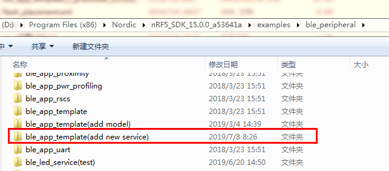
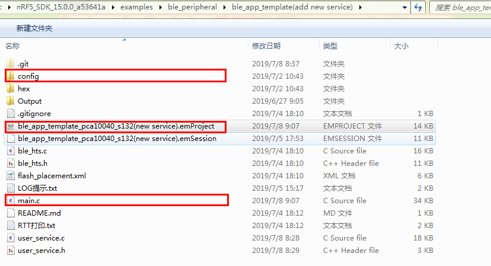
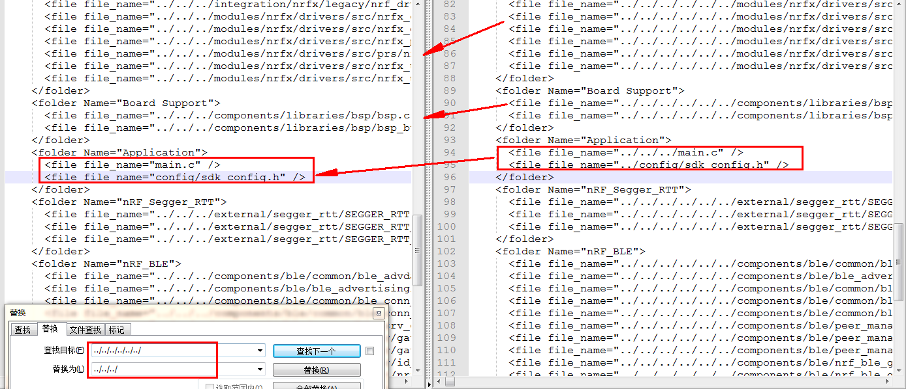
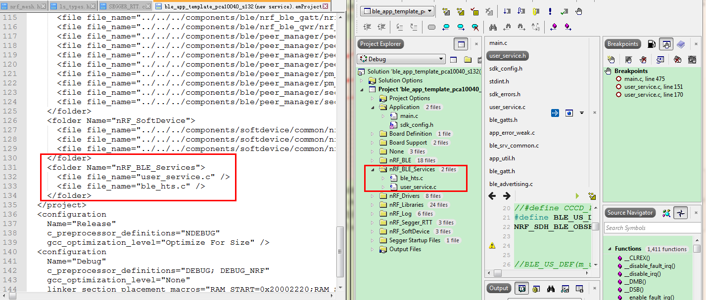
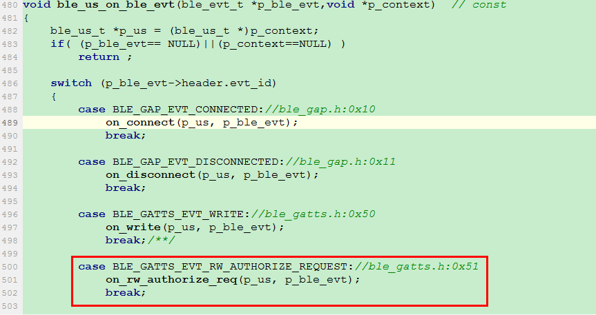
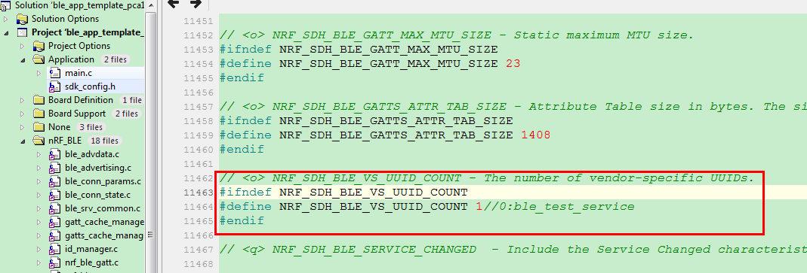

# nRF52_GATTServer

nRF52 BLE_Peripheral新建自定义服务流程：

1、	由于ble_peripheral有模板例程ble_app_template，不妨以此做蓝本来建立自己的service
来处理一些自定义特征值。复制整个文件夹将其命名为ble_app_template(add new service)。

 
将ble_app_template/pca10040/s132/ses下的ble_app_template_pca10040_s132.emProject（工程管理文件）、flash_placement.xml（内部RAM/Flash的分布配置文件）向前移动三级直接到ble_app_template工程文件夹下便于更快进入，同时将ble_app_template/pca10040/s132下config文件夹整个向前移动两级直接到ble_app_template工程文件夹下。此时重命名.emProject文件为ble_app_template_pca10040_s132(new service).emProject，

 

但工程名实际还没修改，用notepad++打开刚才的ble_app_template_pca10040_s132(new service).emProject（实则是.xml文件），修改solution name和project name全等于ble_app_template_pca10040_s132(new service)。由于刚才两个文件（.emProject和flash_placement.xml）前移3级，文件夹config前移2级，必须要同步更改配置让工程自己找得到位置，即全局替换路径“../../../../../../”为“../../../”，标签project configuration里的c_user_include_directories最后一项由“../config”改为“config/”，然后子标签“<folder Name="Application">”里“../../../main.c”改作“main.c”，“../config/sdk_config.h”改作“config/sdk_config.h”：

 

2、	双击打开工程文件ble_app_template_pca10040_s132(new service).emProject，编译（F7）看是否出错，有说明路径没修改对。在左边Project Explorer窗口，右击工程弹出菜单选
择New Folder，取名“BLE_Services”，然后右击该文件夹弹出窗口选择Add new file分别建立user_service.c和user_service.h文件，此时用notepad在打开.emProject发现多了子标签“BLE_Services”和刚才的文件，都是一一对应的。

 

然后进入SES开始编辑源码。

3、创建用户服务实例、注册typedef void(* nrf_sdh_soc_evt_handler_t )(uint32_t evt_id, void *p_context)类型的函数（所有用户读写、连接事件全由它处理）。在main.c中加入“BLE_US_DEF(m_us);//user service”同时在user_service.c中加入宏定义：

    #define BLE_US_DEF(_Obj) static ble_us_t _Obj;
            NRF_SDH_BLE_OBSERVER(_Obj ## _obs,\
     							 BLE_US_BLE_OBSERVER_PRIO,\
     							 ble_us_on_ble_evt, &_Obj)
    void ble_us_on_ble_evt(ble_evt_t *p_ble_evt,void *p_context);
表示创建了一个用户服务实例（括号里参数名必须“_”开头，不然会报错）和重要的类型nrf_sdh_soc_evt_handler_t（nrf_sdh_soc.h）函数ble_us_on_ble_evt。

4、定义自定义服务UUID和底下特征UUID还有服务类型定义和服务初始化类定义。

    //873226dc-f5d8-4586-94f9-6e794c2f6820(Little-endian)
    #define BLE_UUID128_USER_SERVICE_BASE_UUID \
    {0x20,0x68,0x2f,0x4c,0x79,0x6e,0xf9,0x94,0x86,0x45,0xd8,0xf5,0xdc,0x26,0x32,0x87}
    #define BLE_UUID_USER_SERVICE_UUID 0x26dd   //Octet[12:13]
    #define BLE_UUID_TEST_CHAR_UUID0x26de   

    typedef enum
    {
    	BLE_BAS_EVT_NOTIFICATION_ENABLED, /**< Test char notification enabled event. */
    	BLE_BAS_EVT_NOTIFICATION_DISABLED /**< Test char notification disabled event. */
    } ble_us_evt_type_t;

    typedef struct{
    	ble_us_evt_type_t  evt_type;
    	uint16_t  conn_handle;
    }ble_us_evt_t;
    
    typedef struct ble_us_s ble_us_t;
    typedef void (*ble_us_evt_handler_t)(ble_us_t *p_us,ble_us_evt_t *p_evt);
    typedef void (*ble_us_write_evt_handler_t)(ble_us_t* p_us,uint16_tuuid,
       										   uint16_tvalue_handle,
       										   uint8_t const   * p_data,
       										   uint16_tlength);
    
    typedef void (*ble_us_read_evt_handler_t)(ble_us_t * p_us, uint16_t uuid,
      										  uint16_t value_handle);
    
    typedef struct{
    	ble_us_evt_handler_t   evt_handler;
    	ble_us_read_evt_handler_t  read_evt_handler;
    	ble_us_write_evt_handler_t  write_evt_handler;
    	ble_srv_cccd_security_mode_t us_test_attr_md;//ble_srv_common.h
    	uint16_t  test_char_val;
    	bool is_us_notify_support;
    }ble_us_init_t;
    
    struct ble_us_s{
    	ble_us_evt_handler_t   evt_handler;
    	ble_us_read_evt_handler_t  read_evt_handler;
    	ble_us_write_evt_handler_t  write_evt_handler;
    	uint16_t  service_handle;
    	uint16_t  conn_handle;
    	uint8_t   uuid_type;
    	uint16_t  test_char_val;
    	ble_gatts_char_handles_t test_handle;//ble_gatts.h
    };
这些定义彼此耦合，彼此引用，很容易报错，例程设定对属性读、写以及通知。读写函数也声明如下：
    
    void us_gatts_handle_write(ble_us_t  * p_us,  uint16_tuuid,uint16_tval_handle,
							   uint8_t const * p_data,uint16_tlength);
    void us_gatts_handle_read(ble_us_t * p_us, uint16_t uuid, uint16_t val_handle);
同时服务初始函数和nrf_sdh_soc_evt_handler_t类函数也要声明：

    ret_code_t ble_us_init(ble_us_t *p_us,ble_us_init_t *p_us_init);//sdk_errors.h
    void ble_us_on_ble_evt(ble_evt_t *p_ble_evt,void *p_context);// const
对应user_service.c要写出这些函数的实现，具体参考源码，特别强调的是Nordic的读操作是底层调用的，没有透明化，本例程为演示读操作，特意在ble_us_on_ble_evt函数里加入授权读分支来处理，这样便于理解：

 5、头文件包含进来#include "user_service.h"。把广播服务UUID改成自己自定义的具体为：

    static ble_uuid_t m_adv_uuids[] =   /**< Universally unique service identifiers. */
    {
       //{BLE_UUID_DEVICE_INFORMATION_SERVICE, BLE_UUID_TYPE_BLE},
       //{BLE_UUID_HEALTH_THERMOMETER_SERVICE, BLE_UUID_TYPE_BLE} 
	  {BLE_UUID_USER_SERVICE_UUID,BLE_UUID_TYPE_VENDOR_BEGIN}//ble_test_service
    };

6、实施自定义服务初始化。在函数services_init里加入
    ble_us_init_t us_init;
    memset(&us_init, 0, sizeof(us_init));

    us_init.evt_handler=NULL;
    us_init.is_us_notify_support=true;
    us_init.test_char_val=0x08;
    us_init.write_evt_handler = us_gatts_handle_write;
    us_init.read_evt_handler  = us_gatts_handle_read;

    BLE_GAP_CONN_SEC_MODE_SET_OPEN(&us_init.us_test_attr_md.read_perm);
    BLE_GAP_CONN_SEC_MODE_SET_OPEN(&us_init.us_test_attr_md.write_perm);//Flags:

    err_code = ble_us_init(&m_us, &us_init);
    APP_ERROR_CHECK(err_code);
7、细节调整。主函数main里调整两函数services_init和advertising_init的顺序，同时由于引入非SIG标准服务，故此要修改配置文件。打开工程窗口Application文件夹sdk_config.h（即前面提到的config/sdk_config.h），搜索NRF_SDH_BLE_VS_UUID_COUNT，修改成实际个数，本例为2（本例的服务UUID和特征UUID）。

同时第3步定义声明的宏里自定义服务优先级没有定义，也在sdk_config.h里加入

    #ifndef BLE_US_BLE_OBSERVER_PRIO
    #define BLE_US_BLE_OBSERVER_PRIO 2 //ble_test_service
    #endif
编译运行提示存储不足，可按提示进行修改。**